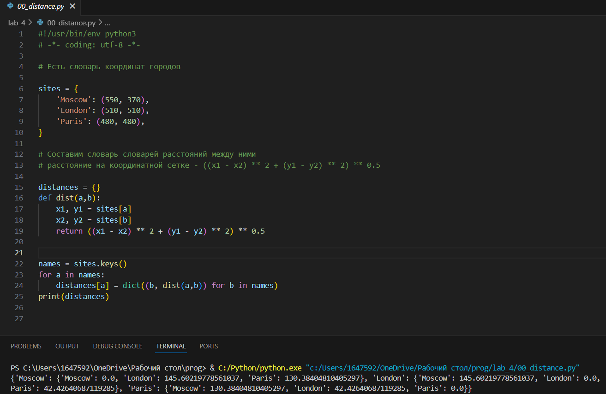
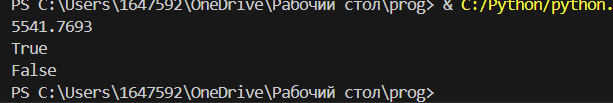
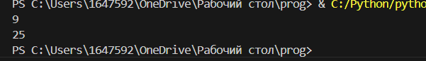
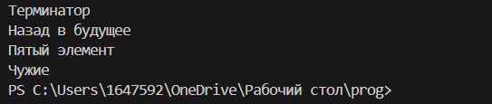
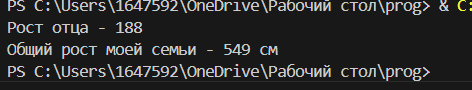
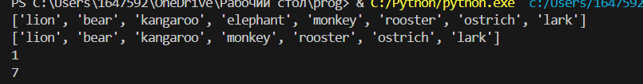
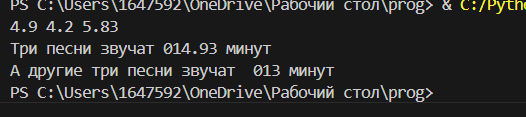
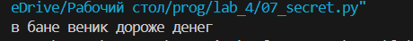
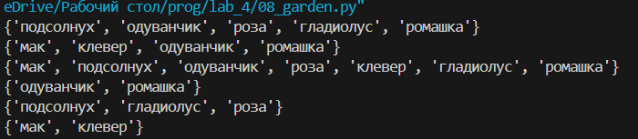
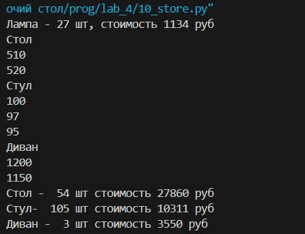

# Лабораторная работа №4
# Задание 
1. Скачать архив и распаковать его в свой репозиторий. В нём 11 заданий, которые нужно выполнить.
2. Оформить отчёт в readme.md.
## Ход работы:
***Распаковал архив из 11 заданий***
### Задание 0
**Составить словарь словарей между городами**

  
### Задание 1
**Вывел на консоль значение площади данного круга с точностю до 4-х знаков после запятой и решил задачу если точка внутри этого круга или за кругом**  

### Задание 2
**Расставил знаки операций "плюс", "минус", "умножение" и скобки**  

### Задание 3
**Вывел на консоль с помощью индексации строки**  

### Задание 4
**Создал список моей семьи, затем вывел рост отца и суммарный рост всей семьи**  

### Задание 5
**Посадил медведя (bear) между львом и кенгуру и вывел список на консоль. Добавил птиц из списка birds в последние клетки зоопарка. **  

### Задание 6
**Вывел общее время звучания трех песен: 'Halo', 'Enjoy the Silence' и 'Clean' и распечатал общее время звучания трех песен: 'Sweetest Perfection', 'Policy of Truth' и 'Blue Dress**  

### Задание 7
**Расшифровал и вывел сообщение**  

### Задание 8
**Создал множество цветов, произрастающих в саду и на лугу. Вывел на консоль все виды цветов. Вывел на консоль те, которые растут и там и там. Вывел на консоль те, которые растут в саду, но не растут на лугу. Вывел на консоль те, которые растут на лугу, но не растут в саду**  

### Задание 9
**Создал словарь цен на продукты, указал 2 магазина с минимальными ценами**  

### Задание 10
**Рассчитал на какую сумму лежит каждого товара на складе. Вывел стоимость каждого вида товара на складе. Распечатал сколько всего столов и их общую стоимость. Распечатал сколько всего стульев и их общую стоимость**  

